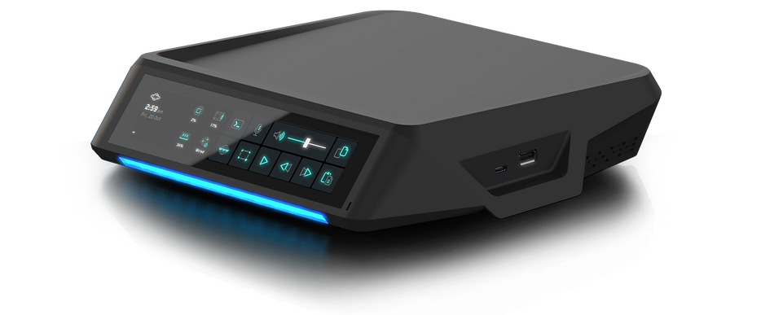
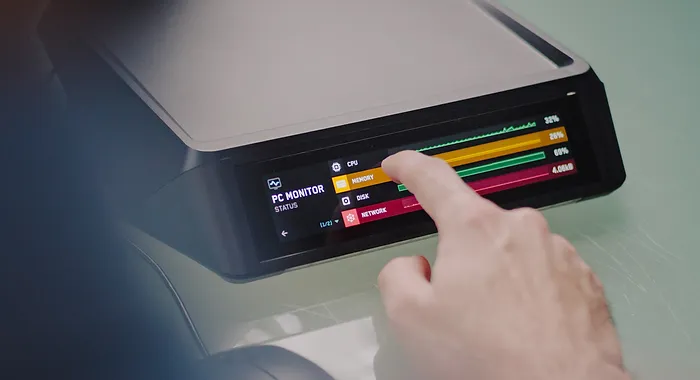
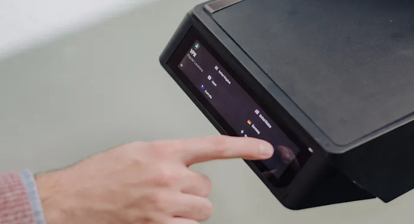

# gitbook

<figure><figcaption>
XR2 by Planet Computers
</figcaption></figure>

This is the new Plant PC **Linux** mini Desktop PC

***

## Linux out of the box

No more searching for drivers, compiling or configuring obscure parameters!\
The XR series runs Ubuntu Linux and is based on ARM multicore processor technology.&#x20;

<figure><figcaption></figcaption></figure>

***

## INTEGRATED TOUCHSCREEN

The new-look XR features a unique integrated colour touchscreen, giving access to soft keys for frequent tasks, a system monitor and controls for WiFi, Bluetooth, audio and other advanced system functions.

&#x20;

<figure><figcaption></figcaption></figure>

***

## ADVANCED FEATURES

Set up VPN, firewall and home network to shield your data and applications straight from the XR.\
\
Internet relay and VPN support to access your data and applications from anywhere with full encryption.\
\
Network disk function allows you to easily set up network shares and even back up your Cosmo or Astro devices over WiFi.

<figure><figcaption></figcaption></figure>

***

## FEATURES WHICH SPARK JOY

XR's front lighting features 16 LEDs that are fully adjustable and notify of system alerts! Fun!\
\
Stereo speakers and a microphone are included for full out-of-the-box audio readiness.\
\
8K and 4K Video output, 4K Video input and top-end video processing capabilities allow you to enjoy the latest media or to process your own media feeds at prosumer quality.

<figure><figcaption></figcaption></figure>

***


Check out the full website to the XR Series of Linux PCs

